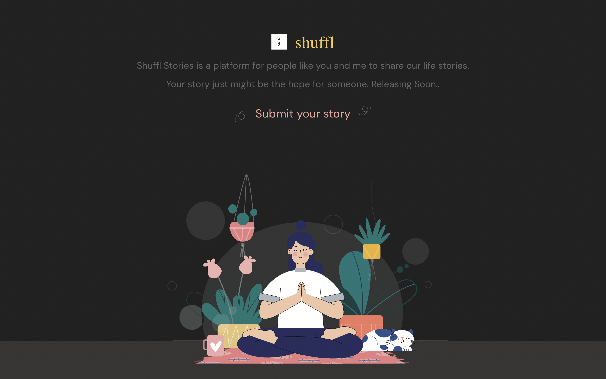

# ShufflStories

## [Check it live here](https://feedform.me/)



Feedform is the fastest way to collect issues, ideas and compliments with a simple widget.
See them on Dashboard or Receive them as email.

## Getting Started

These instructions will get you a copy of the project up and running on your local machine for development and testing purposes. See deployment for notes on how to deploy the project on a live system.

### Installing

Clone the Repository and run

```
npm install
npm start
```

## Deployment

To deploy simply run

```
npm run build
```
